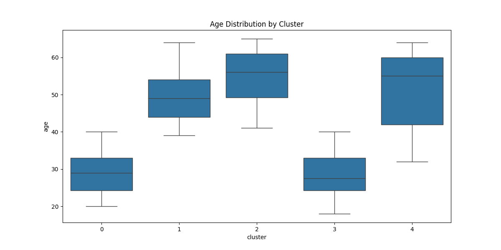
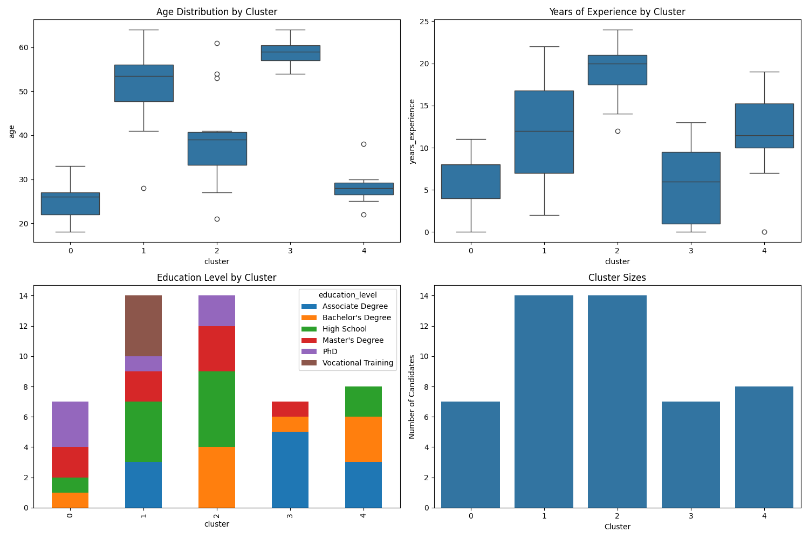

# MagnetoAds

<p align="center">
  
</p>

<p align="center">
  <strong>Intelligent Ad Automation for Targeted Job Recruitment</strong>
</p>

<p align="center">
  <a href="#key-features">Features</a> •
  <a href="#installation">Installation</a> •
  <a href="#usage">Usage</a> •
  <a href="#architecture">Architecture</a> •
  <a href="#api-framework">API Framework</a> •
  <a href="#machine-learning">ML Capabilities</a> •
  <a href="#development">Development</a> •
  <a href="#testing">Testing</a> •
  <a href="#deployment">Deployment</a>
</p>

## Overview

MagnetoAds is a sophisticated ad automation system designed to revolutionize job opening advertisements across social media platforms. It intelligently segments audiences for targeted advertising, integrating seamlessly with Meta (Facebook/Instagram), X (Twitter), and Google APIs to automate ad publishing for Magneto365's job openings.

The system combines machine learning for audience segmentation with a unified API framework, offering powerful campaign management tools, real-time analytics, and collaborative features—all designed to optimize recruitment advertising campaigns and maximize ROI.

## Key Features

### Platform Integration

- **Multi-Platform Publishing**: Deploy ads across Meta, Twitter, and Google with a unified interface
- **Platform-Specific Optimization**: Automated content adaptation for each platform's unique requirements
- **Unified Campaign Management**: Create, monitor, and optimize campaigns across platforms
- **Credential Security**: Advanced management of API keys with rotation and validation

### Audience Targeting

- **ML-Powered Segmentation**: K-means clustering to identify optimal audience segments
- **Demographic Targeting**: Target by age, location, education, experience, and preferences
- **Segment Analysis**: Visualize segment characteristics for better understanding
- **Dynamic Retargeting**: Adjust targeting based on performance metrics

### Campaign Management

- **Streamlined Workflow**: Intuitive wizard for creating multi-platform campaigns
- **Visual Ad Editor**: Create engaging ad content with platform-specific templates
- **Real-time Monitoring**: Track campaign performance as it happens
- **Budget Optimization**: Automated budget allocation across platforms

### Analytics & Insights

- **Performance Dashboard**: Comprehensive overview of campaign metrics
- **ROI Visualization**: Clear representation of return on ad spend
- **Platform Comparison**: Compare effectiveness across different platforms
- **Segment Performance**: Track which audience segments perform best

### Collaboration

- **Team Management**: Create teams with different roles and permissions
- **Campaign Sharing**: Share campaigns with colleagues or clients
- **Notification System**: Real-time updates on campaign status and metrics
- **Activity Tracking**: Monitor changes and updates to campaigns

## Installation

### Prerequisites

- Python 3.11.11 or higher
- Virtual environment tool (venv recommended)
- Git

### Quick Start

1. Clone the repository:

```bash
git clone https://github.com/your-username/magnetoads.git
cd magnetoads
```

2. Create and activate a virtual environment:

```bash
python -m venv venv
source venv/bin/activate  # On Windows: venv\Scripts\activate
```

3. Install dependencies:

```bash
pip install -r requirements.txt
```

4. Configure environment variables:

```bash
cp .env-example .env
# Edit .env to add your API credentials
```

5. Initialize the database:

```bash
flask db setup
```

6. Generate test data:

```bash
flask data generate --candidates 100 --jobs 20
```

7. Train the segmentation model:

```bash
flask data segment --clusters 5 --visualize
```

8. Run the application:

```bash
python app.py
# Visit http://localhost:5000 in your browser
```

## Usage

### Campaign Creation Workflow

1. **Select Job Opening**: Choose from existing job openings or create a new one
2. **Choose Platforms**: Select which social media platforms to target
3. **Define Audience**: Select an ML-generated segment or create custom targeting
4. **Configure Campaign**: Set budget, duration, and optimization goals
5. **Create Ad Content**: Use the visual editor to craft platform-specific creative
6. **Review & Launch**: Confirm settings and launch your campaign
7. **Monitor Performance**: Track metrics and adjust as needed

<p align="center">
  
</p>

### Audience Segmentation

Access powerful machine learning-based audience segmentation:

1. Navigate to the Segments dashboard
2. View existing segments with their characteristics
3. Generate new segments based on updated candidate data
4. Visualize segment distributions and key attributes
5. Apply segments to your campaigns for targeted advertising

<p align="center">
  
</p>

### Analytics & Reporting

Gain insights into campaign performance:

- **Campaign Dashboard**: Overall performance metrics
- **Platform Comparison**: Compare effectiveness across platforms
- **ROI Analysis**: Track return on investment and cost metrics
- **Audience Insights**: Understand which segments perform best
- **A/B Testing**: Compare different ad variations

## Architecture

MagnetoAds follows a modular architecture with clear separation of concerns:

### System Components

```text
magnetoads/
├── app/                  # Main application code
│   ├── models/           # Database models using SQLAlchemy ORM
│   ├── routes/           # API and web routes (Flask blueprints)
│   ├── services/         # Business logic and integrations
│   ├── api_framework/    # Unified API integration framework
│   ├── templates/        # HTML templates (Jinja2)
│   ├── static/           # Static assets (JS, CSS, images)
│   └── utils/            # Utility functions and helpers
├── ml/                   # Machine learning components
│   ├── data/             # Training and test data
│   ├── models/           # Trained ML models
│   ├── segmentation.py   # K-means clustering implementation
│   └── visualizations/   # Generated visualizations
├── tests/                # Comprehensive test suite
└── migrations/           # Database migrations (Alembic)
```

### Database Schema

The core data models represent the following entities:

- **JobOpening**: Job details including title, company, location, requirements
- **Candidate**: Profiles with demographics, education, experience, preferences
- **Segment**: ML-derived audience segments with criteria and descriptions
- **AdCampaign**: Campaign details with platform-specific content and targeting
- **User**: User accounts with authentication and authorization data
- **Team**: Team structures for collaboration features
- **Notification**: System and user notifications
- **PlatformConnectionStatus**: API connection health and credential status

## API Framework

The API Framework provides a standardized approach to social media platform integrations:

### Core Components

- **Base Classes**:
  - `APIRequest`: Standardized request format
  - `APIResponse`: Unified response handling
  - `BaseAPIClient`: Abstract client interface

- **Platform Clients**:
  - `MetaAPIClient`: Facebook/Instagram integration
  - `TwitterAPIClient`: Twitter/X integration
  - `GoogleAPIClient`: Google Ads integration

- **Performance Features**:
  - Request caching with TTL
  - Parallel execution
  - Request batching
  - Metrics collection

- **Campaign Manager**:
  - Cross-platform campaign creation
  - Unified targeting translation
  - Status monitoring

## Machine Learning

MagnetoAds employs sophisticated machine learning for audience segmentation:

### Segmentation Approach

- **K-means Clustering**: Unsupervised learning to group similar candidates
- **Feature Engineering**: Transforms categorical data to numerical representations
- **Optimization**: Automatic cluster count determination using silhouette scores
- **Interpretability**: Human-readable segment descriptions

### Implementation Details

- **Preprocessing Pipeline**: Handles feature transformation
- **Model Persistence**: Stores trained models for production use
- **Visualization**: Provides insights into segment characteristics
- **Platform Translation**: Converts segments to platform-specific targeting options

<p align="center">
  
</p>

## Development

### Directory Structure

```
magnetoads/
├── app/                  # Main application code
│   ├── models/           # Database models
│   ├── routes/           # API and web routes
│   ├── services/         # API integrations and business logic
│   ├── templates/        # HTML templates
│   ├── utils/            # Utility functions and helpers
│   └── static/           # Static files (CSS, JS, images)
├── ml/                   # Machine learning code
│   ├── data/             # Training and test data
│   ├── models/           # Trained models
│   └── visualizations/   # Data visualizations
├── tests/                # Test suite
├── instance/             # Instance-specific data (database)
├── migrations/           # Database migrations
└── docs/                 # Documentation
```

### CLI Commands

The application provides several CLI commands to manage the system:

```bash
# Generate simulated data
flask data generate --candidates 100 --jobs 20

# Train segmentation model
flask data segment --clusters 5 --visualize

# Manage credentials
flask credentials list
flask credentials health
flask credentials rotate META META_ACCESS_TOKEN
flask credentials export .env.backup

# View configuration
flask config show
```

### Code Style

MagnetoAds follows these coding standards:

- **Python**: PEP 8 style guidelines
- **Type Hints**: Explicit typing for function parameters and returns
- **Docstrings**: Multi-line format with Args/Returns sections
- **Error Handling**: Specific exceptions with proper logging
- **Naming**: snake_case for variables/functions, PascalCase for classes
- **Security**: Environment variables for credentials, no hardcoded secrets

### API Response Format

All API endpoints follow a standardized response format:

#### Success Response

```json
{
  "success": true,
  "data": [
    // Response data here
  ],
  "message": "Optional success message"
}
```

#### Error Response

```json
{
  "success": false,
  "message": "Error message",
  "errors": [
    // Optional detailed error information
  ]
}
```

#### Paginated Response

```json
{
  "success": true,
  "data": [
    // Data for current page
  ],
  "pagination": {
    "total": 100,
    "page": 1,
    "per_page": 20,
    "pages": 5
  },
  "message": "Optional success message"
}
```

#### Utility Functions

For implementing this format in new API endpoints, use the utility functions in `app/utils/api_responses.py`:

```python
from app.utils.api_responses import api_success, api_error, paginated_response

# For success responses
return api_success(data=my_data, message="Optional message")

# For error responses
return api_error(message="Error message", errors=error_details, status_code=400)

# For paginated responses
return paginated_response(
    data=page_items,
    total=total_count,
    page=current_page,
    per_page=items_per_page
)
```

## Testing

MagnetoAds includes a comprehensive test suite:

### Test Categories

- **Unit Tests**: Test individual components in isolation
- **Integration Tests**: Test component interactions
- **End-to-End Tests**: Test complete workflows
- **Security Tests**: Verify security measures
- **Performance Tests**: Measure API framework performance

### Running Tests

Run the full test suite:

```bash
python tests/run_tests.py --verbose
```

Run specific test types:

```bash
python tests/run_tests.py --type [unit|integration|e2e|security]
```

Run a single test file:

```bash
pytest tests/test_file.py -v
```

Run a specific test:

```bash
pytest tests/test_file.py::test_function -v
```

## Deployment

### Local Development

```bash
python app.py
```

### Production Deployment

1. Set up environment variables:
   - `FLASK_ENV=production`
   - Configure database connection string
   - Set up API credentials securely

2. Use a production WSGI server:

```bash
gunicorn app:app
```

3. Set up a reverse proxy (Nginx/Apache) in front of the application.

4. Configure proper security measures:
   - HTTPS
   - Rate limiting
   - API key security

### Google Cloud Deployment

MagnetoAds is designed for deployment on Google Cloud Platform:

1. Set up Google Cloud Project with billing enabled
2. Configure Cloud SQL for PostgreSQL with appropriate instance size
3. Prepare Flask app for deployment with app.yaml configuration
4. Deploy app to Google App Engine using Google Cloud SDK
5. Set up monitoring with Cloud Logging and Cloud Monitoring
6. Configure security with IAM roles and secure database connections

## Security

MagnetoAds implements robust security measures:

- **Credential Management**: Secure storage and rotation of API credentials
- **Environment Variables**: No hardcoded secrets
- **Input Validation**: Comprehensive validation for all user inputs
- **CSRF Protection**: Security against cross-site request forgery
- **Error Handling**: Proper error management without information leakage
- **Access Control**: Role-based permissions system

### Future Enhancements

- TikTok and Snapchat platform integrations
- Advanced A/B testing framework
- Mobile application support
- AI-powered ad content generation
- Enhanced analytics and reporting

## License

This project is licensed under the MIT License - see the LICENSE file for details.

## Credits

Developed by Grupo 4 of Ingeniería de Software for internal job opening ad automation.
