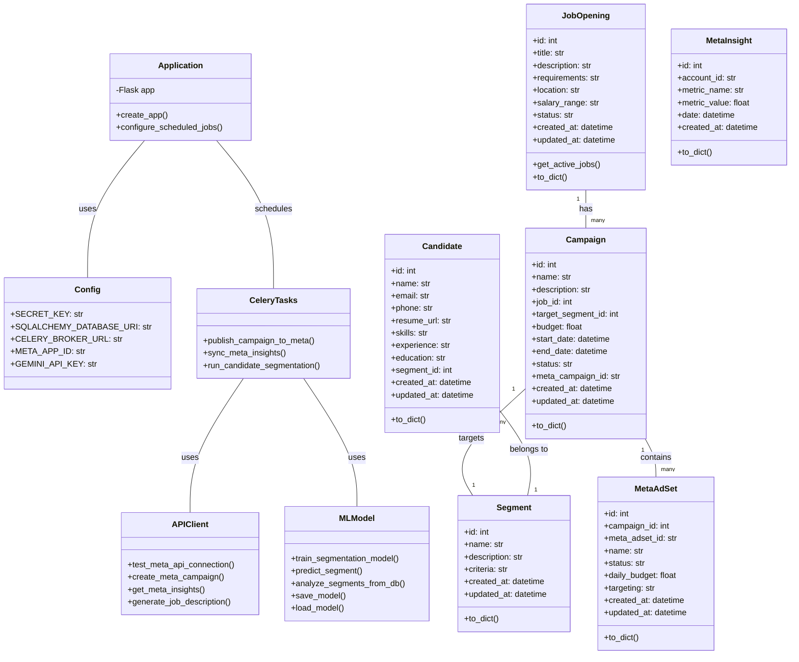
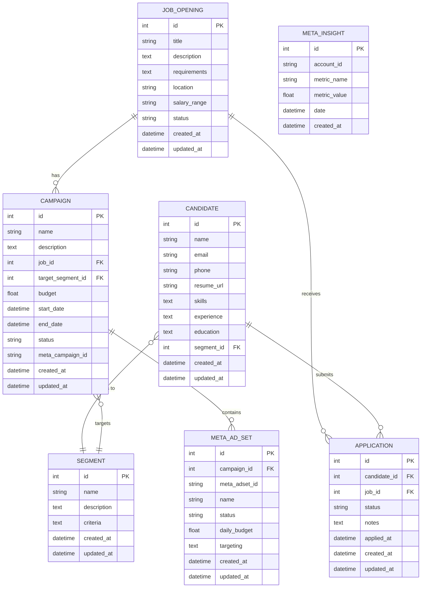
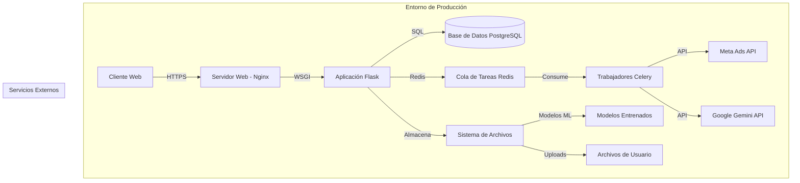

# Diagramas de Arquitectura - AdFlux

## Vista Lógica - Diagrama de Clases de Diseño

El diagrama de clases muestra los componentes principales del sistema AdFlux y sus relaciones:

- **Application**: Representa la aplicación Flask y su configuración
- **Config**: Contiene la configuración del sistema
- **Modelos de datos**: JobOpening, Candidate, Campaign, Segment, MetaInsight, MetaAdSet
- **MLModel**: Componente de aprendizaje automático para segmentación de candidatos
- **APIClient**: Integración con APIs externas (Meta, Google Gemini)
- **CeleryTasks**: Tareas asíncronas para procesamiento en segundo plano

## Vista Lógica - Diagrama Entidad-Relación (Modelo de datos)

El diagrama entidad-relación muestra la estructura de la base de datos relacional de AdFlux:

- **JOB_OPENING**: Almacena información sobre ofertas de trabajo
- **CANDIDATE**: Contiene datos de candidatos
- **SEGMENT**: Define segmentos de candidatos para targeting
- **CAMPAIGN**: Campañas publicitarias asociadas a ofertas de trabajo
- **META_AD_SET**: Conjuntos de anuncios en Meta Ads
- **META_INSIGHT**: Métricas y estadísticas de campañas en Meta
- **APPLICATION**: Aplicaciones de candidatos a ofertas de trabajo

## Vista Física - Diagrama de Despliegue

El diagrama de despliegue muestra cómo se distribuyen los componentes de AdFlux en la infraestructura física:

- **Cliente Web**: Interfaz de usuario accesible a través de navegadores
- **Servidor Web (Nginx)**: Maneja las solicitudes HTTP y sirve archivos estáticos
- **Aplicación Flask**: Implementa la lógica de negocio y las APIs
- **Base de Datos PostgreSQL**: Almacena datos persistentes
- **Cola de Tareas Redis**: Gestiona tareas asíncronas
- **Trabajadores Celery**: Procesan tareas en segundo plano
- **APIs Externas**: Meta Ads y Google Gemini
- **Sistema de Archivos**: Almacena modelos ML y archivos subidos por usuarios

Este diseño permite una arquitectura escalable y modular, donde cada componente puede escalar independientemente según las necesidades.
